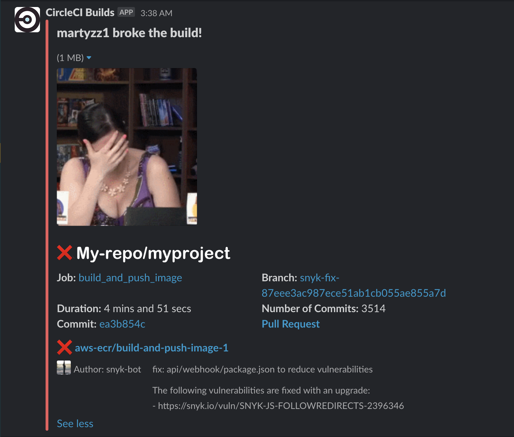
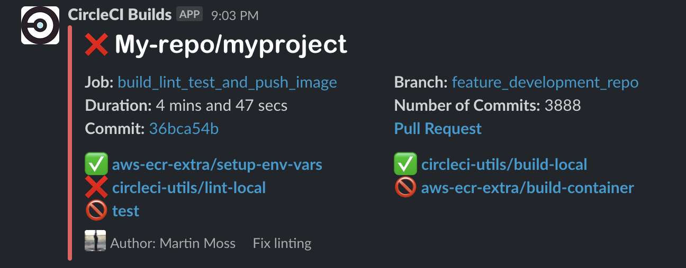
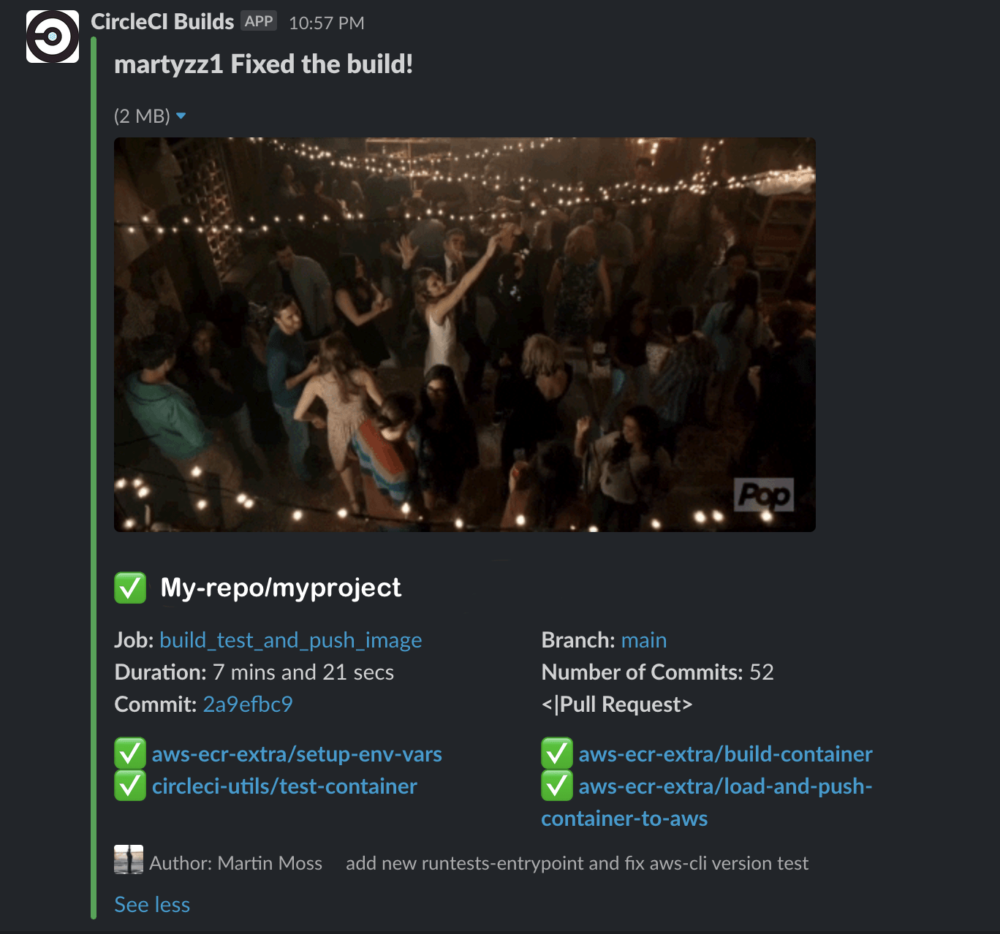
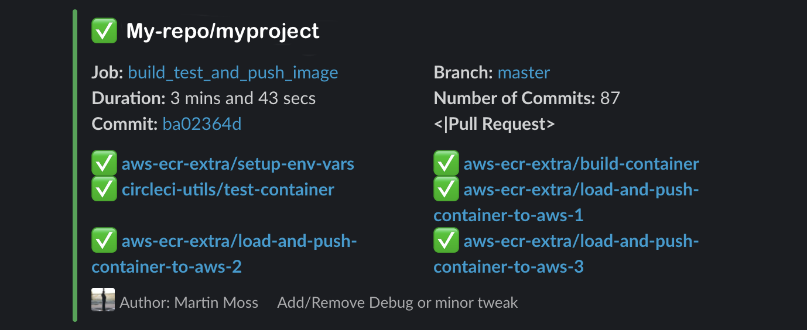

# Orb Project Template

[](https://circleci.com/gh/martyzz1/slack-notifier) [](https://circleci.com/orbs/registry/orb/martyzz1/slack-notifier) [](https://raw.githubusercontent.com/martyzz1/slack-notifier/master/LICENSE) [](https://discuss.circleci.com/c/ecosystem/orbs)

## What does it do?

### You Broke the Build!


### Still Broken


### You Fixed the Build!


### All is still good


## Resources

[CircleCI Orb Registry Page](https://circleci.com/orbs/registry/orb/martyzz1/slack-notifier) - The official registry page of this orb for all versions, executors, commands, and jobs described.
[CircleCI Orb Docs](https://circleci.com/docs/2.0/orb-intro/#section=configuration) - Docs for using and creating CircleCI Orbs.

### How to Contribute

We welcome [issues](https://github.com/martyzz1/slack-notifier/issues) to and [pull requests](https://github.com/martyzz1/slack-notifier/pulls) against this repository!

### How to Publish
* Create and push a branch with your new features.
* When ready to publish a new production version, create a Pull Request from _feature branch_ to `master`.
* The title of the pull request must contain a special semver tag: `[semver:<segement>]` where `<segment>` is replaced by one of the following values.

| Increment | Description|
| ----------| -----------|
| major     | Issue a 1.0.0 incremented release|
| minor     | Issue a x.1.0 incremented release|
| patch     | Issue a x.x.1 incremented release|
| skip      | Do not issue a release|

Example: `[semver:major]`

* Squash and merge. Ensure the semver tag is preserved and entered as a part of the commit message.
* On merge, after manual approval, the orb will automatically be published to the Orb Registry.

For further questions/comments about this or other orbs, visit the Orb Category of [CircleCI Discuss](https://discuss.circleci.com/c/orbs).

## Known Issue

You may get this error when pushing a new PR,

```bash
The dev version of martyzz1/slack-notifier@dev:alpha has expired. Dev versions of orbs are only valid for 90 days after publishing.
```

If you see this error, you need to publish a dev:alpha version manually. The fix is to run this:

```bash
circleci orb pack ./src | circleci orb validate -
circleci orb pack ./src | circleci orb publish -  martyzz1/slack-notifier@dev:alpha
```

## Usage

To use the orb add this:
```yaml
    version: '2.1'
orbs:
  slacknotifier: martyzz1/slack-notifier@2.0.0
workflows:
  use-my-orb:
    jobs:
      - slacknotifier/slack-workflow-monitor:
          giphy-failure-keyword: broken
          giphy-success-keyword: party
          workflow-name: use-my-orb
      - build
      - lint
      - test

```

to your `.circleci/config.yml` file.

Usage, examples and docs:

* [Commands](src/commands/README.md)
* [Executors](src/executors/README.md)
* [Jobs](src/jobs/README.md)
* [Scripts](src/scripts/README.md)
* [Orb](src/README.md)
* [Examples](src/examples/README.md)
